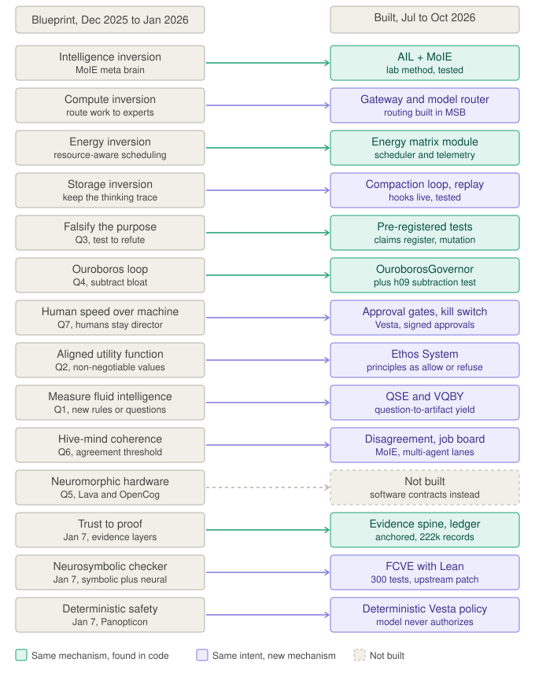

# Sovereign white papers compared with the later architecture

Not an originality claim, a proof claim, or a claim that any paper was fully implemented: it asks how far the early papers' ideas correspond to mechanisms built later. Commits and code named here were inspected (OBSERVED); the rest is CLAIMED. No claim row added.

## Chronology
Commit dates were checked; repository creation dates come from the supplied analysis. 2025-12-16: Drive document "The Singularity Architecture". 2025-12-29: `STEM_SCAFFOLDING` `8491aed` (names AIL, RISE, MoIE). 2026-01-04: `814a0b3`, ten papers in `sovereign_whitepapers/`. 2026-01-07: the evidence repo indexes seven. Later: MSB v3 (2026-07-24), domain-router (08-09), FCVE (09-19), this lab (09-28).

## Labels
**STRONG**: directly instantiated. **PARTIAL**: key structure matches, not fully implemented. **CONCEPTUAL**: recurs as design language. **UNRESOLVED**: no specific later artifact found.

## Matrix

| Early paper or idea | Later correspondence | Label | Does not hold |
|---|---|---|---|
| Verifiable AI Evidence Layers (trust to proof) | Evidence Spine (`cb8cace`, `e8f8d3c`), Merkle proofs (`7fd5007`), audit chain, FCVE evidence graph | STRONG | The paper's ZKP, control-barrier and Sigstore stack |
| Panopticon Protocol (probability to determinism) | ActionGate, fail-closed permissions, kill switch, approval gates, deterministic Vesta policy | PARTIAL | Wasm, TEE, zkVM and consensus design |
| NanoApex / Recursive Agent Architecture (static to recursive) | RISE and RGDP (2025-12-29), PLEI lifecycle loop, flywheel, D1 | CONCEPTUAL | Level-6 autonomous self-improvement |
| Neurosymbolic SAT Solver (symbolic and neural) | FCVE: model proposes, Lean kernel checks, independent checker | PARTIAL | The GNN, CDCL and LLM solver itself |
| Sovereign Compute Blueprint (reactive to active inference) | Local-first runtime, scheduler and heartbeat, PLEI | PARTIAL | An Active Inference kernel |
| Computational Thermodynamics of Love | Four axioms (love, abundance, safety, growth), Ethos System, self-healing | CONCEPTUAL | No empirical demonstration that love is a thermodynamic operator |
| Singularity: Ouroboros loop (Q4, subtract bloat) | `OuroborosGovernor`, hygiene test `h09_dependency_subtraction`, retired components | STRONG | |
| Singularity: energy inversion | `src/msb_v3/energy_matrix/` (scheduler, telemetry); depth not examined | STRONG | |
| Singularity: compute and storage inversions | Gateway and model router; compaction loop, replay, memory fabric | PARTIAL | |
| Singularity: aligned values and human speed (Q2, Q7) | Ethos System; approval gates, kill switch, signed approvals | PARTIAL | Consciousness alignment and remote-viewing input were not carried over |
| Singularity: measuring fluid intelligence (Q1, Gc to Gf) | QSE and the VQBY metric; QSE's own terminal test is UNRESOLVED | CONCEPTUAL | |
| Singularity: neuromorphic hardware (Q5) | Not built; the no-wrapper-bloat principle kept as software contracts | UNRESOLVED | |

## Cross-domain result
The same transformation recurs in governed execution (MSB v3), formal verification (FCVE), lifecycle intelligence (PLEI), routing (domain-router) and research operations (this lab): architectural recurrence across domains, not proof that each domain was specified in January.

## Negative findings and a correction
- Several named technologies (ZKP, TEE, zkVM, full Active Inference, SAT-specific networks) are aspirational; a keyword in a later repository is not implementation evidence.
- The first version of this comparison marked the Singularity Architecture UNRESOLVED because it searched for the headline inversion. The paper's mechanisms are in its seven questions; the rows above were found by searching for those.
- The folder holds ten papers; Infinite Storage Audit, Teleological Topology and Dolores Cannon Claims were not compared.

## Suggestions
1. Pin each row (early file and heading to later file and commit) so it can be checked mechanically.
2. Have a model from a different family redo the matrix blind to this one.
3. Compare the three uncovered papers, and add pending claim rows for the strongest matches.
4. Run the pre-registered Hermes12 benchmark and CVT-1: the matrix shows continuity, not advantage over alternatives.
5. Call the love and thermodynamics paper a conceptual artifact in public text.
